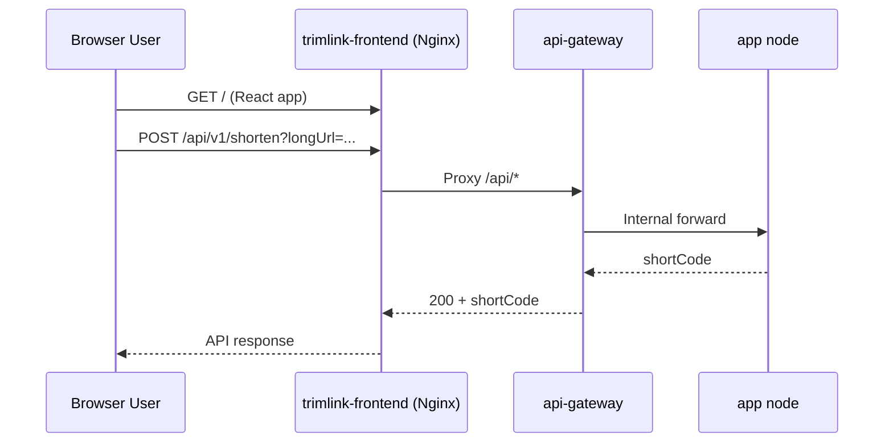
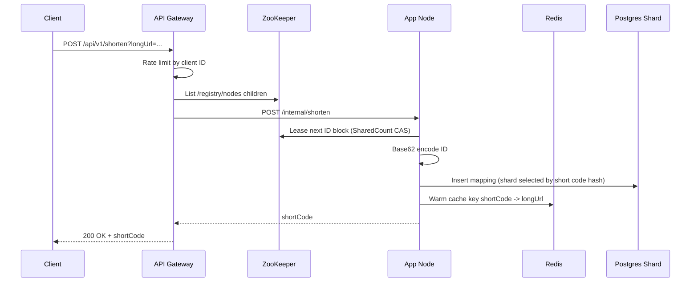
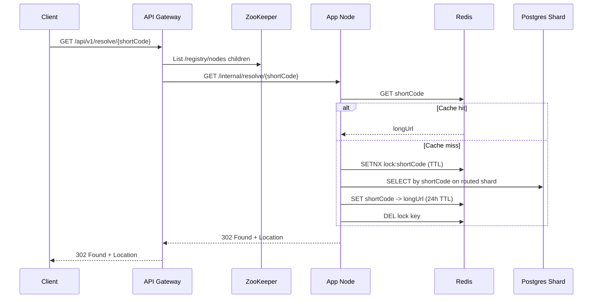

# TrimLink Current State Architecture

This document describes the architecture implemented in the current repository state.

## Runtime Modes

The same Spring Boot artifact runs in two profiles.

1. gateway profile
1. Registers gateway-only beans such as Redis-based rate limiter filter.
1. Hosts public API ingress and proxies requests to app nodes discovered from ZooKeeper.

1. default profile (app node)
1. Registers node in ZooKeeper discovery path as an ephemeral znode.
1. Handles internal shorten/resolve operations.
1. Leases unique ID ranges from ZooKeeper shared counter.

## Deployed Components

Current docker-compose topology:

1. trimlink-frontend (1)
1. api-gateway (1)
1. node-1..node-5 (5)
1. redis-cache (1)
1. postgres-shard-0..2 (3)
1. zookeeper-service (1)

Client entrypoint in current compose:

1. Browser calls trimlink-frontend on port 3000.
1. Nginx serves static React build and proxies /api/* to api-gateway:8080.

### Frontend Request Edge Path

## Request Flows

### 1. Create Short URL (Write Path)

Key details:

1. Gateway selection strategy is round-robin over discovered live nodes.
1. Shard target is selected by Murmur3 consistent hash ring in routing datasource.

### 2. Resolve Short URL (Read Path)

## Data Model

Entity: url_mappings

1. id BIGINT PRIMARY KEY
1. short_code VARCHAR(10) UNIQUE NOT NULL
1. long_url VARCHAR(2048) NOT NULL
1. created_at TIMESTAMP NOT NULL

Notes:

1. Table is auto-created by startup SQL in sharded datasource config.
1. JPA entity field shortCode maps to short_code via default naming strategy.

## Coordination And Discovery

1. Node discovery path: /registry/nodes/<hostname> (ephemeral znodes).
1. KGS global sequence path: /kgs_global_sequence (Curator SharedCount).
1. Each lease grants 1000 IDs per node block.

## Sharding Strategy

1. Thread-local shard context stores active shortCode.
1. Routing datasource computes target shard by Murmur3 consistent hash with 200 virtual nodes per shard.
1. If no shard key is set, defaults to postgres-shard-0.

## Rate Limiting

Gateway profile uses Redis sorted-set sliding window:

1. Key format: rate_limit:<clientId>
1. Window: 60000 ms
1. Limit: 100 requests per window
1. Fail-open if Redis errors occur

## API Surface (Current)

Public and internal endpoints in current code:

1. POST /api/v1/shorten (gateway proxy)
1. GET /api/v1/resolve/{shortCode} (gateway proxy)
1. GET /api/v1/{shortCode} (direct redirect controller path)
1. POST /internal/shorten (node)
1. GET /internal/resolve/{shortCode} (node)

## Known Drift And Gaps

1. README historical claims (gateway consistent-hash routing to 10 nodes) do not match current implementation (round-robin to 5 nodes).
1. Test suite currently only contains context-load test.
1. Secrets and DB credentials are hardcoded in several places.
1. Cache-miss wait path uses recursion and should be bounded iterative retry.
1. Internal endpoints are not authenticated.

## Production-Readiness Priorities

1. Security and config externalization
1. remove hardcoded secrets
1. use env-driven config and secret manager
1. Reliability and correctness
1. bounded retry loops, timeouts, circuit breaker
1. add health/readiness probes
1. Observability
1. structured logs, request IDs, metrics dashboards
1. Testing and release safety
1. unit/integration/e2e coverage
1. CI gates on pull requests