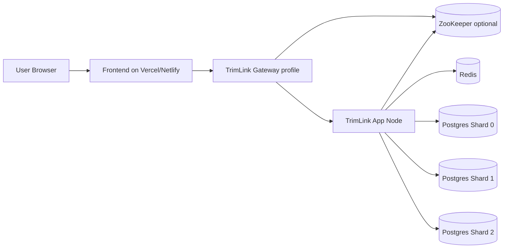

# Free-Tier Distributed Deployment Guide

This guide deploys a miniature but distributed TrimLink setup on free tiers:

1. One gateway instance (profile `gateway`)
2. One or more app-node instances (default profile)
3. Optional ZooKeeper service
4. One Redis service
5. Three Postgres shard databases
6. One frontend static host

## Recommended Free Providers

1. ZooKeeper: optional (skip for Valkey-first mode)
2. Redis: Upstash free tier
3. Postgres shards: Neon (3 projects) or Supabase alternatives
4. Java services: Fly.io or Railway
5. Frontend: Vercel or Netlify

## Valkey-First Mode (No ZooKeeper)

Use this mode when ZooKeeper is unavailable:

1. Set `TRIMLINK_ZOOKEEPER_ENABLED=false`
2. Set `TRIMLINK_KGS_PROVIDER=redis`
3. Set `TRIMLINK_GATEWAY_STATIC_NODES` to app-node hostnames reachable by gateway

In this mode:

1. Distributed key ranges are leased atomically from Redis/Valkey
2. Gateway node discovery uses static host list instead of ZooKeeper

## Prerequisites

1. Create all managed services and collect credentials.
2. Ensure app-node hostnames are reachable by gateway (private/internal DNS preferred).
3. Store secrets in provider secret manager.

## Environment Variables

Use the variables in [.env.free-tier.example](../.env.free-tier.example).

Critical values:

1. `TRIMLINK_ZOOKEEPER_ENABLED`
2. `TRIMLINK_KGS_PROVIDER`
3. `TRIMLINK_GATEWAY_STATIC_NODES` (required when ZooKeeper disabled)
2. `REDIS_HOST`, `REDIS_PORT`, `REDIS_PASSWORD`
3. `TRIMLINK_DB_SHARD_0_URL`, `TRIMLINK_DB_SHARD_1_URL`, `TRIMLINK_DB_SHARD_2_URL`
4. `TRIMLINK_DB_USERNAME`, `TRIMLINK_DB_PASSWORD`
5. `TRIMLINK_NODE_ADVERTISED_HOST` on each app-node deployment (used when ZooKeeper enabled)

## Deploy Order

1. Deploy Redis/Valkey and all three Postgres shard DBs.
2. (Optional) Deploy ZooKeeper if using `TRIMLINK_KGS_PROVIDER=zookeeper`.
2. Deploy first app-node service with default profile and set:
   - `TRIMLINK_NODE_ADVERTISED_HOST` to the node DNS name reachable by gateway.
3. Deploy gateway service with `SPRING_PROFILES_ACTIVE=gateway`.
4. Deploy frontend and set backend base URL to gateway public URL.

## Fly.io Templates Included

Use these templates:

1. [deploy/fly/node.fly.toml](../deploy/fly/node.fly.toml)
2. [deploy/fly/gateway.fly.toml](../deploy/fly/gateway.fly.toml)

Example sequence:

1. Create node app and deploy with node template.
2. Set secrets from [.env.free-tier.example](../.env.free-tier.example).
3. If ZooKeeper is enabled, confirm node registers into ZooKeeper.
4. If ZooKeeper is disabled, confirm `TRIMLINK_GATEWAY_STATIC_NODES` includes your app-node host.
5. Create gateway app and deploy with gateway template.
6. Set same infra secrets on gateway app.
7. Test shorten and resolve endpoints through gateway URL.

## Deployment Topology



## Health Checks

1. Gateway shorten endpoint:

```bash
curl -X POST "https://<gateway-url>/api/v1/shorten?longUrl=https://example.com" -H "X-Client-ID: smoke"
```

2. Resolve endpoint:

```bash
curl -i "https://<gateway-url>/api/v1/resolve/<shortCode>"
```

## Common Failure Modes

1. `Zero active compute nodes detected`: gateway could not resolve nodes from ZooKeeper or static list is empty.
2. `Shard not ready`: wrong shard JDBC URL, credentials, or TLS params.
3. Redis timeout: wrong host/port/password or provider network restriction.

## Minimal Scaling Strategy

1. Start with 1 app node.
2. Add a second app node only after successful smoke checks.
3. Keep DB pool sizes modest on free tiers if memory pressure appears.
